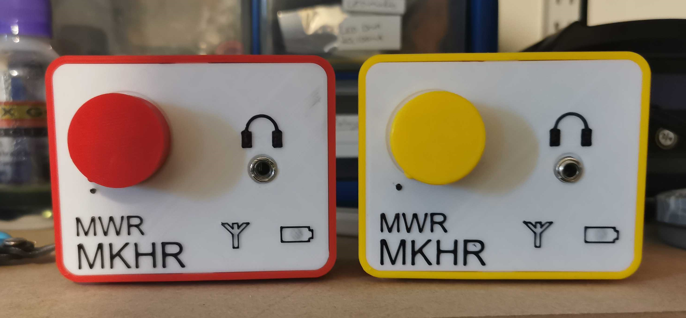
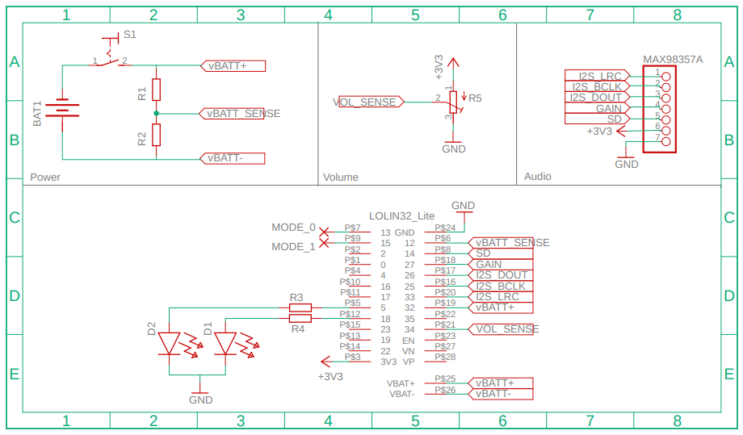

# Mini Web Radio
Originally designed as a charity project, the MWR is a simple single-station battery powered internet radio. The design features a combined power-volume dial and 3.5mm headphone socket, utilising a 3D printed case and is based around:

* WeMos Lolin32 Lite (ESP32)
* MAX98357A I2S Dac Amplifier
* 18650 Lithium Battery


</br>



</br>
  
## Documents

* [User Guide](Documentation/MWR_User_Guide.pdf)

* [Technical Guide](Documentation/MWR_Technical_Guide.pdf)

* [Bill Of Materials](Documentation/BOM.pdf)

</br>

## Configuration

The MWR has built-in browser based configuration which allows you to define the Hostname, Wireless network credentials and the playback URL.

> Enable Configuration mode

1. Switch Off MWR
2. Open Faceplate 
3. Install jumper (2.54mm) or short pins 13 and 15
4. Turn On MWR
5. Connect to `MWR-WIFI-SETUP` network
6. Remove Jumper
6. Navigate browser to `192.168.1.1`
7. Enter configuration Details and select `Save`
8. The MWR will automatically restart into radio mode and begin playback

## Firmware

Code for both the Arduino IDE and Plaform.io are included under the firmare directory

</br>

### Arduino IDE

1. Download and install the following libaries:

    * [ESPAsyncWebServer](https://github.com/me-no-dev/ESPAsyncWebServer)

    * [ESP32-AudioI2S](https://github.com/schreibfaul1/ESP32-audioI2S)

2. Download and install the following Tools:

    * [ESPTool_py](https://github.com/me-no-dev/arduino-esp32fs-plugin/releases/)

3. Add the _Additional Board URL_ to the IDE properties (File > Preferences)

    ```https://raw.githubusercontent.com/espressif/arduino-esp32/gh-pages/package_esp32_index.json```

4. Using the _Board Manager_ add the board **esp32 - by Expressif Systems** (Tools > Board Manager)

5. Select the board: **Lolin32 Lite**

</br>

## Enclosure

Files for 3D printing the shell, face and dial are provided in the [CAD](CAD) directory. The enclosure uses a snaplock design to secure the face to the shell which can be difficult to lock into place initially, a small screw driver or spudger can make it easier to pry it open and closed.

**Print Settings:**

> These are just the settings that have worked for me, your milage may differ

* 0.4mm Nozzle
* 0.2mm Layer Height
* 5% Infill
* 1.75mm PLA+ Filament

</br>

## Schematic



